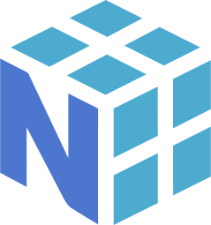
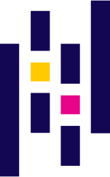
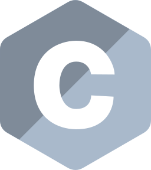

<a style="display:none;">Kovrizhnukh Dmitrii CV</a>

# <a id="works" href="#works">👨🏻‍💻 Work experience 3 years</a>
* ### Junior analyst and Data Scientist
   * September 2022 ‑ Nowdays
   * [Consultant.ru](https://www.consultant.ru/)
 
NLP, solving the problem of text classification, summarization and generation. 

Modification of text retrieval and sorting algorithms, and evaluation of accuracy, completeness, and more comprehensive metrics of
evaluations. 

Reduction of file classification errors. Support for an internal service for model evaluation, usage, and filtering across different document banks.

* ### Junior Python developer
   * August 2021 ‑ August 2023, Part‑time
   * PrintBox (Self-worker)

Keeping campus printers, alerting mechanisms, and server operations up and running. 

Adding scanning functionality, reducing transfer times for large files and reducing failures due to the
congestion

* ### Data Engineer
   * October 2020 ‑ March 2022, Part‑time
   * Acronis (MIPT Department)

Finding hyper-parameters for clustering hash sums of files, calculating performance metrics (mainly True Positive)
as well as estimating file clustering time under different parameters.

We found clustering parameters that missed one malicious file by $10^6$ clean. Evaluation of metrics for different parameters of infected files and their detection depending on the classifier and virus databases

# <a id="education" href="#education">🎓 Education</a>

* ### Moscow Institute of Physics and Technology (Bachelor's Degree)
    (2019-2023, Moscow) Faculty of Management and Applied Mathematics (FPMI PMF)
  
* ### Moscow Institute of Physics and Technology (Master's Degree)
    (2023-2025, Moscow) Fiztech School of Applied Mathematics and Computer Science "Cloud Technologies" ATP

# <a id="skills" href="#skills">🛠️ Skills</a>

* ### Primary stack: 
    Python, ML/DL, Nature Language Processing, Analytics, Computer vision
    

      
      
      
      
      
      
      
      
    

* ### Secondary stack
    SQL, Desktop apps, web, UI, API, embedded
    

      
          
      
      
      
      
      
  

* ### Other
    CI/CD, Automatization, Scripting, 
    

      
      
      
      
      
      
      
    

# <a id="projects" href="#projects">🧩 Open source projects </a>
* **[ML MIPT course](https://github.com/HCL-271/ml-course-Fall-)** - MIPT course on machine learning, its revision and finalization
* **[Calculation time of PageRank vector calculation](https://github.com/HCL-271/Page_rank)** - Research paper on optimization of Pagerank vector calculation time
* **[Stock_Price_Prediction](https://github.com/HCL-271/Stock_Price_Prediction)** - A project on predicting stock prices by different methods and comparing their performance. Presentation at a scientific conference
* **[File System course](https://github.com/HCL-271/filesystems-101-exercises)** - A course on file systems

# <a id="contacts" href="#contacts">📧 Contacts</a>
* Mail: [kovrizhnykh.diu@phystech.edu](mailto:kovrizhnykh.diu@phystech.edu)
* Profile on [Github](https://github.com/HCL-271/HCL-271.github.io/tree/main)
