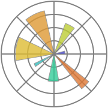

<a style="display:none;">Коврижных Дмитрий Резюме</a>

# <a id="works" href="#works">👨🏻‍💻 Опыт работы 3 years</a>
* ### Младший аналитик данных (Junior analyst and Data Scientist)
   * Cентябрь 2022 ‑ Настоящее время
   * КонсультантПлюс
 
NLP, решение задачи классификации, обобщения и генерации текстов. 

Модификация алгоритмов поиска и сортировки текстов, а также оценка метрик точности, полноты и более комплексных метрик
оценки. 

Уменьшение числа ошибок классификации файлов. Поддержка внутреннего сервиса для оценки моделей, использования и фильтрации по различным банкам документов.

* ### Младший питон разработчик (Junior Python developer)
   * Август 2021 ‑ Август 2023, Part‑time
   * PrintBox (Самозанятый)

Поддержка работоспособности принтеров на территории кампуса, механизмов оповещения и работы сервера. 

Добавление функционала сканирования, уменьшение времени передачи больших файлов и уменьшение числа отказов из‑за
загруженности

* ### Инженер данных (Data Engineer)
   * Октябрь 2020 ‑ Maрт 2022, Part‑time
   * Acronis (Кафедра МФТИ)

Нахождение гипер‑параметров для кластеризации хэш‑сумм файлов, вычисление метрик эффективности (в основном True Positive)
а также оценка времени кластеризации файлов при различных параметрах.

Найдены параметры кластеризации, пропускавшие один вредоносный файл на $10^6$ чистых. Оценка метрик по различным параметрам зараженных файлов и их обнаружения в зависимости от классификатора и баз вирусов

# <a id="education" href="#education">🎓 Образование</a>

* ### Московский Физико‑Технический Институт (Бакалавриат)
    (2019-2023, Moscow) Факультет управления и прикладной математики (ФПМИ ПМФ)
  
* ### Московский Физико‑Технический Институт (Магистратура)
    (2023-2025, Moscow) Физтех-школа прикладных математики и информатики ”Облачные технологии” АТП

# <a id="skills" href="#skills">🛠️ Навыки</a>

* ### Основные навыки: 
    Python, ML/DL, Nature Language Processing, Analytics, Computer vision
    

      
      
      
      
      
      
      
      
    

* ### Вторичные навыки:
    SQL, Desktop apps, web, UI, API, embedded
    

      
          
      
      
      
      
      
  

* ### Также работал
    CI/CD, Automatization, Scripting, 
    

      
      
      
      
      
      
      
    

# <a id="projects" href="#projects">🧩 Проекты </a>
* **[ML MIPT course](https://github.com/HCL-271/ml-course-Fall-)** - курс МФТИ по машинному обучению, его редакция и доработка
* **[Подсчёт времени вычисления вектора PageRank](https://github.com/HCL-271/Page_rank)** - Научная работа по оптимизации времени вычисления вектоар Pagerank
* **[Stock_Price_Prediction](https://github.com/HCL-271/Stock_Price_Prediction)** - Проект по предсказанию цен акций различными способами, а также сравнение их эффективности. Выступление на научной конференции
* **[File System course](https://github.com/HCL-271/filesystems-101-exercises)** - Курс по файловым системам

# <a id="contacts" href="#contacts">📧 Контакты</a>
* Почта: [kovrizhnykh.diu@phystech.edu](mailto:kovrizhnykh.diu@phystech.edu)
* Профиль на гит-хабе: [Github](https://github.com/HCL-271/HCL-271.github.io/tree/main)
